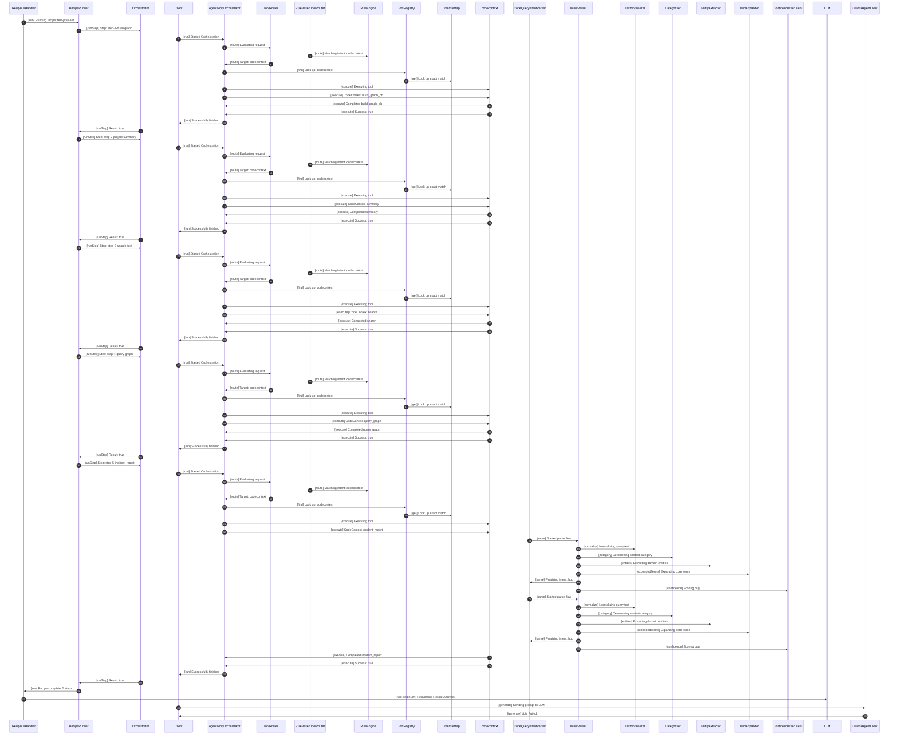

```mermaid
sequenceDiagram
    autonumber
    RecipeCliHandler ->> RecipeRunner: [run] Running recipe: test-java-ast
    RecipeRunner ->> Orchestrator: [runStep] Step: step-1-build-graph
    Client ->> AgentLoopOrchestrator: [run] Started Orchestration
    AgentLoopOrchestrator ->> ToolRouter: [route] Evaluating request
    RuleBasedToolRouter ->> RuleEngine: [route] Matching intent: codecontext
    ToolRouter ->> AgentLoopOrchestrator: [route] Target: codecontext
    AgentLoopOrchestrator ->> ToolRegistry: [find] Look up: codecontext
    ToolRegistry ->> InternalMap: [get] Look up exact match
    AgentLoopOrchestrator ->> codecontext: [execute] Executing tool
    AgentLoopOrchestrator ->> codecontext: [execute] CodeContext  build_graph_db
    codecontext ->> AgentLoopOrchestrator: [execute] Completed  build_graph_db
    codecontext ->> AgentLoopOrchestrator: [execute] Success: true
    AgentLoopOrchestrator ->> Client: [run] Successfully finished
    Orchestrator ->> RecipeRunner: [runStep] Result: true
    RecipeRunner ->> Orchestrator: [runStep] Step: step-2-project-summary
    Client ->> AgentLoopOrchestrator: [run] Started Orchestration
    AgentLoopOrchestrator ->> ToolRouter: [route] Evaluating request
    RuleBasedToolRouter ->> RuleEngine: [route] Matching intent: codecontext
    ToolRouter ->> AgentLoopOrchestrator: [route] Target: codecontext
    AgentLoopOrchestrator ->> ToolRegistry: [find] Look up: codecontext
    ToolRegistry ->> InternalMap: [get] Look up exact match
    AgentLoopOrchestrator ->> codecontext: [execute] Executing tool
    AgentLoopOrchestrator ->> codecontext: [execute] CodeContext summary
    codecontext ->> AgentLoopOrchestrator: [execute] Completed summary
    codecontext ->> AgentLoopOrchestrator: [execute] Success: true
    AgentLoopOrchestrator ->> Client: [run] Successfully finished
    Orchestrator ->> RecipeRunner: [runStep] Result: true
    RecipeRunner ->> Orchestrator: [runStep] Step: step-3-search-text
    Client ->> AgentLoopOrchestrator: [run] Started Orchestration
    AgentLoopOrchestrator ->> ToolRouter: [route] Evaluating request
    RuleBasedToolRouter ->> RuleEngine: [route] Matching intent: codecontext
    ToolRouter ->> AgentLoopOrchestrator: [route] Target: codecontext
    AgentLoopOrchestrator ->> ToolRegistry: [find] Look up: codecontext
    ToolRegistry ->> InternalMap: [get] Look up exact match
    AgentLoopOrchestrator ->> codecontext: [execute] Executing tool
    AgentLoopOrchestrator ->> codecontext: [execute] CodeContext search
    codecontext ->> AgentLoopOrchestrator: [execute] Completed search
    codecontext ->> AgentLoopOrchestrator: [execute] Success: true
    AgentLoopOrchestrator ->> Client: [run] Successfully finished
    Orchestrator ->> RecipeRunner: [runStep] Result: true
    RecipeRunner ->> Orchestrator: [runStep] Step: step-4-query-graph
    Client ->> AgentLoopOrchestrator: [run] Started Orchestration
    AgentLoopOrchestrator ->> ToolRouter: [route] Evaluating request
    RuleBasedToolRouter ->> RuleEngine: [route] Matching intent: codecontext
    ToolRouter ->> AgentLoopOrchestrator: [route] Target: codecontext
    AgentLoopOrchestrator ->> ToolRegistry: [find] Look up: codecontext
    ToolRegistry ->> InternalMap: [get] Look up exact match
    AgentLoopOrchestrator ->> codecontext: [execute] Executing tool
    AgentLoopOrchestrator ->> codecontext: [execute] CodeContext  query_graph
    codecontext ->> AgentLoopOrchestrator: [execute] Completed query_graph
    codecontext ->> AgentLoopOrchestrator: [execute] Success: true
    AgentLoopOrchestrator ->> Client: [run] Successfully finished
    Orchestrator ->> RecipeRunner: [runStep] Result: true
    RecipeRunner ->> Orchestrator: [runStep] Step: step-5-incident-report
    Client ->> AgentLoopOrchestrator: [run] Started Orchestration
    AgentLoopOrchestrator ->> ToolRouter: [route] Evaluating request
    RuleBasedToolRouter ->> RuleEngine: [route] Matching intent: codecontext
    ToolRouter ->> AgentLoopOrchestrator: [route] Target: codecontext
    AgentLoopOrchestrator ->> ToolRegistry: [find] Look up: codecontext
    ToolRegistry ->> InternalMap: [get] Look up exact match
    AgentLoopOrchestrator ->> codecontext: [execute] Executing tool
    AgentLoopOrchestrator ->> codecontext: [execute] CodeContext  incident_report
    CodeQueryIntentParser ->> IntentParser: [parse] Started parse flow
    IntentParser ->> TextNormalizer: [normalize] Normalizing query text
    IntentParser ->> Categorizer: [category] Determining context category
    IntentParser ->> EntityExtractor: [entities] Extracting domain entities
    IntentParser ->> TermExpander: [expandedTerms] Expanding core terms
    IntentParser ->> CodeQueryIntentParser: [parse] Finalizing intent: bug
    IntentParser ->> ConfidenceCalculator: [confidence] Scoring bug
    CodeQueryIntentParser ->> IntentParser: [parse] Started parse flow
    IntentParser ->> TextNormalizer: [normalize] Normalizing query text
    IntentParser ->> Categorizer: [category] Determining context category
    IntentParser ->> EntityExtractor: [entities] Extracting domain entities
    IntentParser ->> TermExpander: [expandedTerms] Expanding core terms
    IntentParser ->> CodeQueryIntentParser: [parse] Finalizing intent: bug
    IntentParser ->> ConfidenceCalculator: [confidence] Scoring bug
    codecontext ->> AgentLoopOrchestrator: [execute] Completed  incident_report
    codecontext ->> AgentLoopOrchestrator: [execute] Success: true
    AgentLoopOrchestrator ->> Client: [run] Successfully finished
    Orchestrator ->> RecipeRunner: [runStep] Result: true
    RecipeRunner ->> RecipeCliHandler: [run] Recipe complete: 5 steps
    RecipeCliHandler ->> LLM: [runRecipeLlm] Requesting Recipe Analysis
    Client ->> OllamaAgentClient: [generate] Sending prompt to LLM
    OllamaAgentClient ->> Client: [generate] LLM Failed
```
