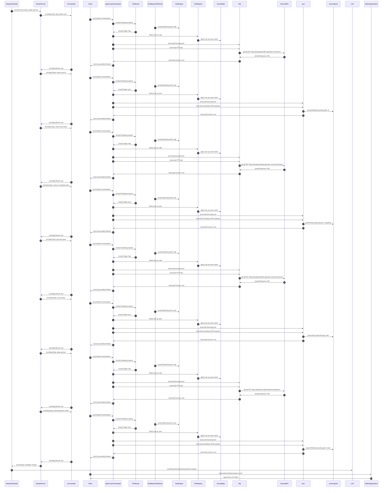

```mermaid
sequenceDiagram
    autonumber
    RecipeCliHandler ->> RecipeRunner: [run] Running recipe: public-api-test
    RecipeRunner ->> Orchestrator: [runStep] Step: get-random-user
    Client ->> AgentLoopOrchestrator: [run] Started Orchestration
    AgentLoopOrchestrator ->> ToolRouter: [route] Evaluating request
    RuleBasedToolRouter ->> RuleEngine: [route] Matching intent: http
    ToolRouter ->> AgentLoopOrchestrator: [route] Target: http
    AgentLoopOrchestrator ->> ToolRegistry: [find] Look up: http
    ToolRegistry ->> InternalMap: [get] Look up exact match
    AgentLoopOrchestrator ->> http: [execute] Executing tool
    AgentLoopOrchestrator ->> http: [execute] HTTP get
    http ->> ExternalAPI: [send] GET https://jsonplaceholder.typicode.com/users/1
    ExternalAPI ->> http: [send] Response: 200
    http ->> AgentLoopOrchestrator: [execute] Success: true
    AgentLoopOrchestrator ->> Client: [run] Successfully finished
    Orchestrator ->> RecipeRunner: [runStep] Result: true
    RecipeRunner ->> Orchestrator: [runStep] Step: assert-user-id
    Client ->> AgentLoopOrchestrator: [run] Started Orchestration
    AgentLoopOrchestrator ->> ToolRouter: [route] Evaluating request
    RuleBasedToolRouter ->> RuleEngine: [route] Matching intent: json
    ToolRouter ->> AgentLoopOrchestrator: [route] Target: json
    AgentLoopOrchestrator ->> ToolRegistry: [find] Look up: json
    ToolRegistry ->> InternalMap: [get] Look up exact match
    AgentLoopOrchestrator ->> json: [execute] Executing tool
    AgentLoopOrchestrator ->> json: [execute] Evaluating JSON payload
    json ->> JsonAnalyzer: [assertPathEq] Asserting path: id
    json ->> AgentLoopOrchestrator: [execute] Success: true
    AgentLoopOrchestrator ->> Client: [run] Successfully finished
    Orchestrator ->> RecipeRunner: [runStep] Result: true
    RecipeRunner ->> Orchestrator: [runStep] Step: check-user-todos
    Client ->> AgentLoopOrchestrator: [run] Started Orchestration
    AgentLoopOrchestrator ->> ToolRouter: [route] Evaluating request
    RuleBasedToolRouter ->> RuleEngine: [route] Matching intent: http
    ToolRouter ->> AgentLoopOrchestrator: [route] Target: http
    AgentLoopOrchestrator ->> ToolRegistry: [find] Look up: http
    ToolRegistry ->> InternalMap: [get] Look up exact match
    AgentLoopOrchestrator ->> http: [execute] Executing tool
    AgentLoopOrchestrator ->> http: [execute] HTTP get
    http ->> ExternalAPI: [send] GET https://jsonplaceholder.typicode.com/users/1/todos
    ExternalAPI ->> http: [send] Response: 200
    http ->> AgentLoopOrchestrator: [execute] Success: true
    AgentLoopOrchestrator ->> Client: [run] Successfully finished
    Orchestrator ->> RecipeRunner: [runStep] Result: true
    RecipeRunner ->> Orchestrator: [runStep] Step: search-completed-todos
    Client ->> AgentLoopOrchestrator: [run] Started Orchestration
    AgentLoopOrchestrator ->> ToolRouter: [route] Evaluating request
    RuleBasedToolRouter ->> RuleEngine: [route] Matching intent: json
    ToolRouter ->> AgentLoopOrchestrator: [route] Target: json
    AgentLoopOrchestrator ->> ToolRegistry: [find] Look up: json
    ToolRegistry ->> InternalMap: [get] Look up exact match
    AgentLoopOrchestrator ->> json: [execute] Executing tool
    AgentLoopOrchestrator ->> json: [execute] Evaluating JSON payload
    json ->> JsonAnalyzer: [searchKey] Searching key: completed
    json ->> AgentLoopOrchestrator: [execute] Success: true
    AgentLoopOrchestrator ->> Client: [run] Successfully finished
    Orchestrator ->> RecipeRunner: [runStep] Result: true
    RecipeRunner ->> Orchestrator: [runStep] Step: get-user-posts
    Client ->> AgentLoopOrchestrator: [run] Started Orchestration
    AgentLoopOrchestrator ->> ToolRouter: [route] Evaluating request
    RuleBasedToolRouter ->> RuleEngine: [route] Matching intent: http
    ToolRouter ->> AgentLoopOrchestrator: [route] Target: http
    AgentLoopOrchestrator ->> ToolRegistry: [find] Look up: http
    ToolRegistry ->> InternalMap: [get] Look up exact match
    AgentLoopOrchestrator ->> http: [execute] Executing tool
    AgentLoopOrchestrator ->> http: [execute] HTTP get
    http ->> ExternalAPI: [send] GET https://jsonplaceholder.typicode.com/users/1/posts
    ExternalAPI ->> http: [send] Response: 200
    http ->> AgentLoopOrchestrator: [execute] Success: true
    AgentLoopOrchestrator ->> Client: [run] Successfully finished
    Orchestrator ->> RecipeRunner: [runStep] Result: true
    RecipeRunner ->> Orchestrator: [runStep] Step: count-posts
    Client ->> AgentLoopOrchestrator: [run] Started Orchestration
    AgentLoopOrchestrator ->> ToolRouter: [route] Evaluating request
    RuleBasedToolRouter ->> RuleEngine: [route] Matching intent: json
    ToolRouter ->> AgentLoopOrchestrator: [route] Target: json
    AgentLoopOrchestrator ->> ToolRegistry: [find] Look up: json
    ToolRegistry ->> InternalMap: [get] Look up exact match
    AgentLoopOrchestrator ->> json: [execute] Executing tool
    AgentLoopOrchestrator ->> json: [execute] Evaluating JSON payload
    json ->> JsonAnalyzer: [searchKey] Searching key: title
    json ->> AgentLoopOrchestrator: [execute] Success: true
    AgentLoopOrchestrator ->> Client: [run] Successfully finished
    Orchestrator ->> RecipeRunner: [runStep] Result: true
    RecipeRunner ->> Orchestrator: [runStep] Step: poke-api-test
    Client ->> AgentLoopOrchestrator: [run] Started Orchestration
    AgentLoopOrchestrator ->> ToolRouter: [route] Evaluating request
    RuleBasedToolRouter ->> RuleEngine: [route] Matching intent: http
    ToolRouter ->> AgentLoopOrchestrator: [route] Target: http
    AgentLoopOrchestrator ->> ToolRegistry: [find] Look up: http
    ToolRegistry ->> InternalMap: [get] Look up exact match
    AgentLoopOrchestrator ->> http: [execute] Executing tool
    AgentLoopOrchestrator ->> http: [execute] HTTP get
    http ->> ExternalAPI: [send] GET https://pokeapi.co/api/v2/pokemon/pikachu
    ExternalAPI ->> http: [send] Response: 200
    http ->> AgentLoopOrchestrator: [execute] Success: true
    AgentLoopOrchestrator ->> Client: [run] Successfully finished
    Orchestrator ->> RecipeRunner: [runStep] Result: true
    RecipeRunner ->> Orchestrator: [runStep] Step: assert-pokemon-name
    Client ->> AgentLoopOrchestrator: [run] Started Orchestration
    AgentLoopOrchestrator ->> ToolRouter: [route] Evaluating request
    RuleBasedToolRouter ->> RuleEngine: [route] Matching intent: json
    ToolRouter ->> AgentLoopOrchestrator: [route] Target: json
    AgentLoopOrchestrator ->> ToolRegistry: [find] Look up: json
    ToolRegistry ->> InternalMap: [get] Look up exact match
    AgentLoopOrchestrator ->> json: [execute] Executing tool
    AgentLoopOrchestrator ->> json: [execute] Evaluating JSON payload
    json ->> JsonAnalyzer: [assertPathEq] Asserting path: name
    json ->> AgentLoopOrchestrator: [execute] Success: true
    AgentLoopOrchestrator ->> Client: [run] Successfully finished
    Orchestrator ->> RecipeRunner: [runStep] Result: true
    RecipeRunner ->> RecipeCliHandler: [run] Recipe complete: 8 steps
    RecipeCliHandler ->> LLM: [runRecipeLlm] Requesting Recipe Analysis
    Client ->> OllamaAgentClient: [generate] Sending prompt to LLM
    OllamaAgentClient ->> Client: [generate] LLM Failed
```
